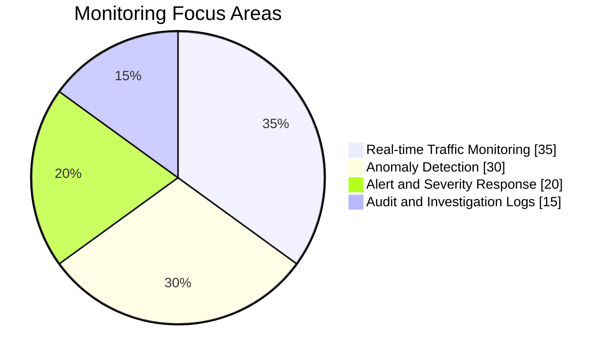
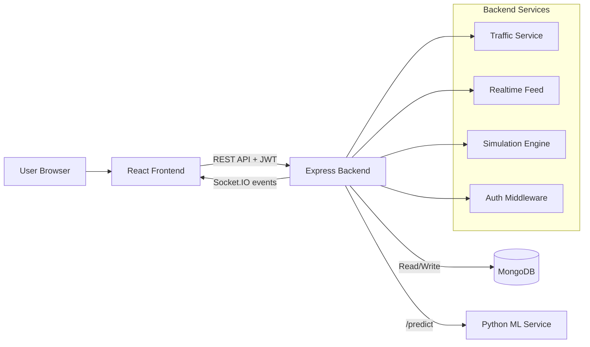
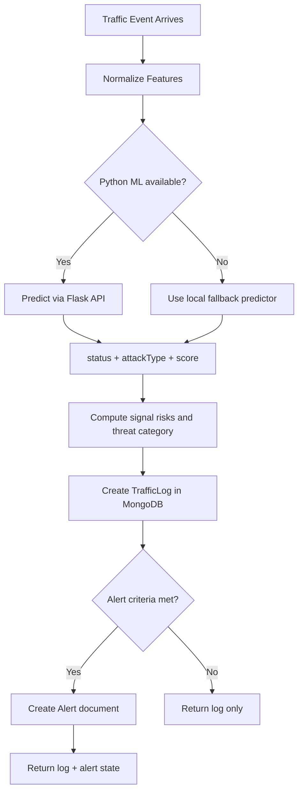
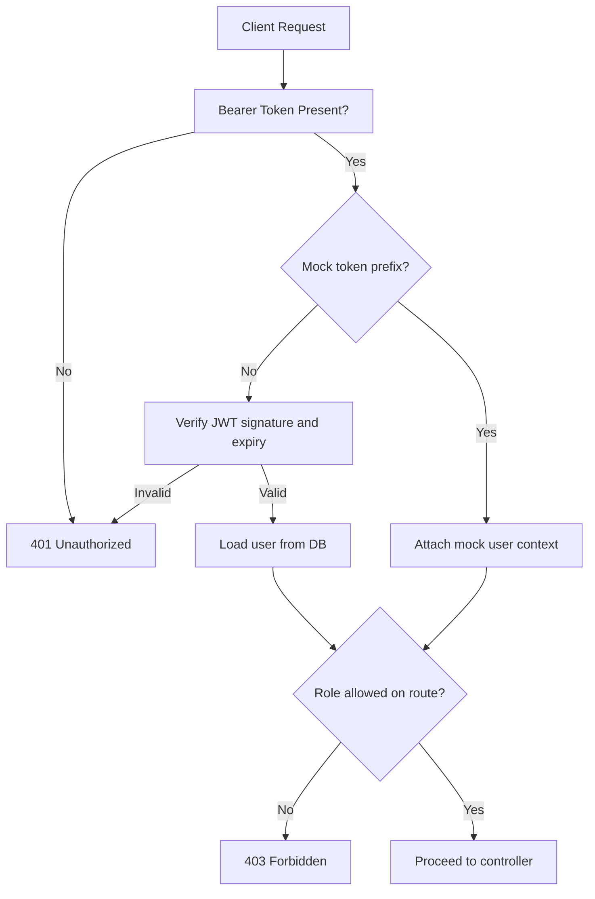
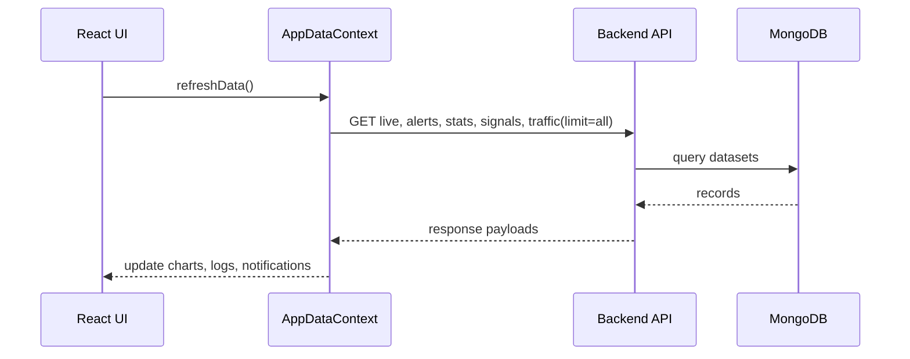
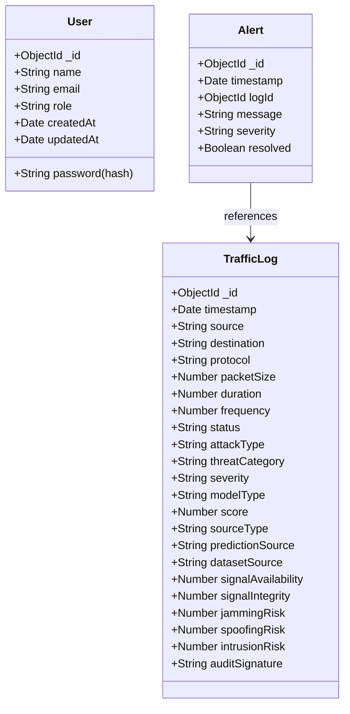

# Military Communication Monitoring System

A full-stack platform for monitoring military communication metadata, detecting unusual patterns, and supporting role-based security operations through clear dashboards and alerts.

## Problem Statement

Military and defense communication networks generate large volumes of operational traffic metadata every second. Teams need to quickly detect suspicious communication behavior, identify potential threats, and respond without exposing sensitive message content.

Traditional monitoring tools are often either too generic, too noisy, or not designed for role-based defense workflows. This creates delayed response, inconsistent visibility across teams, and weak audit trails during incident investigation.

This project addresses that gap by providing a secure, role-aware monitoring system that analyzes communication patterns in real time, highlights anomalies, classifies likely attack behavior, and preserves auditable records for operational review.


## Quick Visual Snapshot



## Table of Contents

- [Problem Statement](#problem-statement)
- [Quick Visual Snapshot](#quick-visual-snapshot)
- [Project Overview](#project-overview)
- [Key Outcomes](#key-outcomes)
- [Unique Value Proposition](#unique-value-proposition)
- [Core Feature Set](#core-feature-set)
- [Feature Deep Dive](#feature-deep-dive)
- [Architecture](#architecture)
- [System Flowcharts](#system-flowcharts)
- [Technology Stack](#technology-stack)
- [Directory Structure](#directory-structure)
- [Role-Based Access Control](#role-based-access-control)
- [Data Models](#data-models)
- [API Reference](#api-reference)
- [Frontend Pages and Behavior](#frontend-pages-and-behavior)
- [Machine Learning Service](#machine-learning-service)
- [Threat Logic and Signal Health](#threat-logic-and-signal-health)
- [Setup and Run Guide](#setup-and-run-guide)
- [Environment Variables](#environment-variables)
- [Operational Workflow](#operational-workflow)
- [PDF Log Sharing](#pdf-log-sharing)
- [Security and Auditability](#security-and-auditability)
- [Performance and Scalability Notes](#performance-and-scalability-notes)
- [Known Limitations](#known-limitations)
- [Testing Checklist](#testing-checklist)
- [Troubleshooting](#troubleshooting)
- [Future Enhancements](#future-enhancements)
- [License](#license)

## Project Overview

This project delivers a real-time command dashboard for monitoring communication traffic and identifying suspicious behavior using hybrid ML inference:

- Python service for model inference (`Isolation Forest` and `Random Forest`)
- Node.js backend for ingestion, risk scoring, alert generation, and APIs
- React frontend for role-aware dashboards and control surfaces
- MongoDB for durable logs, users, and alert history

The system is designed to support operations teams with:

- immediate visibility into network posture
- deterministic threat category fallback (no undefined threat bucket)
- controlled simulation for attack-response validation
- auditable records with signed metadata and PDF report export

## Key Outcomes

- Full role model implemented: `Admin`, `Analyst`, `Monitor`
- User management connected to MongoDB (no temporary-only user table)
- Dashboard traffic trend sourced from shared MongoDB history for multi-user consistency
- Live stream balanced to avoid anomaly-only bias
- Threat category normalization to avoid `None` in monitoring/log views
- Logs view supports full history retrieval (`limit=all`)
- Calendar pickers visible and usable across all active themes
- Professional authentication UI suitable for final delivery

## Unique Value Proposition

This project is not just a standard dashboard; it solves several practical security-monitoring problems that commonly appear in demo-to-production transitions.

### 1) Hybrid Detection Resilience

Most monitoring systems fail when the ML service is unavailable. Here, the backend automatically falls back to a local predictor so ingestion and monitoring stay live. This provides operational continuity instead of total outage.

### 2) Deterministic Threat Categorization

A frequent analytics issue is undefined categories (for example, `None`) polluting dashboards and summaries. This project enforces deterministic fallback logic so every row can still be categorized into meaningful threat dimensions.

### 3) Balanced Live Stream for Realistic Ops View

Live streams often become biased during testing (for example, anomaly-heavy feeds), which distorts KPI decisions. This system injects controlled normal traffic cadence to preserve a realistic ratio and avoid misleading threat percentages.

### 4) Shared Historical Truth Across Users

Instead of user-local trend buffers, charts and history are rebuilt from persisted MongoDB records, ensuring different operators see the same operational story at the same time.

### 5) Audit-Oriented Logging

Traffic events include signed metadata (`auditSignature`) so records can be reviewed with stronger trust semantics. This supports forensic and post-incident workflows beyond simple observability.

### 6) Built-In Reporting Workflow

The logs module is not read-only; it includes practical reporting controls (date-time range, PDF generation, top communicator summary, share capability) that support real command-room handoff.

## Core Feature Set

| Domain | Features |
|---|---|
| Authentication | Register, Login, JWT validation, mock-token fallback for backend unavailability |
| Authorization | Route-level and page-level role guards |
| Monitoring | Live traffic table, status coloring, threat categorization, signal availability/integrity |
| Analytics | Time series trend, anomaly ratio, threat category counters, signal risk widgets |
| Alerting | Auto-alert creation from anomaly/risk thresholds, severity tracking |
| Simulation | Controlled anomaly generation (`DDoS`, `Spoofing`, `Intrusion`) |
| User Management | Admin CRUD: list, create, role update, delete |
| Logs | Search, filter, date narrowing, attack-type filtering, threat + signal metrics |
| Reporting | PDF export/share with date ranges and top communicator summary |
| Visualization | Network graph using React Flow with anomaly edge highlighting |
| Settings | Refresh interval, alert threshold, theme (`dark`, `light`, `blue`) |

## Feature Deep Dive

### Authentication and Session Handling

- Supports account registration and secure login with JWT-based authentication.
- Includes token validation in middleware with clear error paths for malformed/expired tokens.
- Provides controlled mock-token behavior for fallback operation when backend services are unavailable in constrained demo environments.

### Role-Based Security and Access Design

- Three-role model: `Admin`, `Analyst`, `Monitor`.
- Frontend and backend both enforce role boundaries: route-level protection, page-level gatekeeping, and permission-aware navigation.
- Privileged operations such as user administration and audit actions remain restricted through middleware authorization checks.

### Real-Time Monitoring Engine

- Streams traffic into live monitoring views with status and threat context.
- Uses signal-health indicators (`availability`, `integrity`) and risk dimensions (`jamming`, `spoofing`, `intrusion`) for operational interpretation.
- Highlights anomalies with distinct row states and direct linkage to alert generation.

### Threat Analytics and Dashboard Intelligence

- Combines trend lines, anomaly ratio, and category-level counters for quick decision awareness.
- Includes protocol posture and attack distribution indicators for a compact command summary.
- Maintains multi-user consistency by rebuilding graphs from shared persisted history.

### Alerting and Incident Workflow

- Auto-generates alerts when anomaly/risk thresholds are crossed.
- Tracks severity and resolution state for triage lifecycle.
- Supports analyst/admin audit views for post-event review.

### Historical Logs and Investigative Filtering

- Full history retrieval using `limit=all` support for comprehensive analysis windows.
- Filtering by date, attack type, source/destination, severity, and threat context.
- Enhanced date picker usability across themes to reduce operator friction.

### Simulation and Validation Capability

- Supports controlled generation of attack scenarios (`DDoS`, `Spoofing`, `Intrusion`).
- Useful for validating detection quality, dashboard responsiveness, and alerting workflows without waiting for organic incidents.

### User Administration

- Admin-only user CRUD linked to MongoDB.
- Includes role assignment and role updates for command hierarchy management.
- Replaces temporary/in-memory user management with persistent operational controls.

### Export and Reporting

- Generates structured PDF logs from selected date windows.
- Includes threat category, signal metrics, severity data, and top communicator summary.
- Supports direct share/download flow for handover and reporting.

## Architecture



## System Flowcharts

### 1) Traffic Ingestion and Decisioning



### 2) Role Authorization Flow



### 3) Frontend Refresh Lifecycle



## Technology Stack

| Layer | Tech |
|---|---|
| Frontend | React 18, React Router v6, Axios, Recharts, React Flow, jsPDF, Vite |
| Backend | Node.js, Express, Mongoose, JWT, bcryptjs, Socket.IO |
| ML Service | Python, Flask, scikit-learn, numpy, joblib |
| Database | MongoDB |
| Transport | HTTP REST + Socket.IO events |

## Directory Structure

```text
backend/
  app.js
  server.js
  config/
    db.js
  controllers/
    trafficController.js
    userController.js
  middleware/
    auth.js
  models/
    User.js
    TrafficLog.js
    Alert.js
  routes/
    userRoutes.js
    trafficRoutes.js
  services/
    trafficService.js
    realtimeFeed.js
    simulationEngine.js
  ml_service/
    app.py
    train_model.py
    requirements.txt

frontend/
  src/
    pages/
    components/
    context/
    services/
    utils/
    layouts/
```

## Role-Based Access Control

### Role Capability Matrix

| Capability | Admin | Analyst | Monitor |
|---|:---:|:---:|:---:|
| View Dashboard | Yes | Yes | Yes |
| Real-Time Monitoring | Yes | Yes | Yes |
| Alerts Page | Yes | Yes | Yes |
| Network Graph | Yes | Yes | Yes |
| Logs Page | Yes | Yes | No |
| Trigger Simulation | Yes | No (UI note allows but route restricts to Admin) | No |
| Manage Users | Yes | No | No |
| View/Adjust Settings | Yes | Yes (frontend visibility) | Yes (frontend visibility) |
| Admin User CRUD API | Yes | No | No |
| Resolve Alerts API | Yes | Yes | No |
| Audit Summary API | Yes | Yes | No |

### Navigation Guards

Frontend uses role-aware menu filtering and route wrappers:

- protected route check for authentication token
- optional `requiredRoles` checks on sensitive pages
- sidebar links derived from role-permission mapping

Backend enforces role checks using middleware for privileged endpoints.

## Data Models

### Entity Relationship Diagram



### Traffic Status Semantics

| Field | Values | Meaning |
|---|---|---|
| status | `Normal`, `Anomaly` | Classification result |
| attackType | `None`, `DDoS`, `Spoofing`, `Intrusion` | Attack label |
| threatCategory | `Jamming`, `Spoofing`, `Intrusion`, `Mixed` | Higher-level category used in UI |
| severity | `Low`, `Medium`, `High`, `Critical` | Alerting priority |

## API Reference

Base URL: `http://localhost:5000`

### Authentication and Users

| Method | Endpoint | Auth | Roles | Description |
|---|---|---|---|---|
| POST | `/api/users` | No | Public | Register user |
| POST | `/api/users/login` | No | Public | Login user |
| GET | `/api/users` | Yes | Admin | List all users |
| POST | `/api/users/admin` | Yes | Admin | Create user by admin |
| PATCH | `/api/users/:id/role` | Yes | Admin | Update user role |
| DELETE | `/api/users/:id` | Yes | Admin | Delete user |

### Traffic and Monitoring

| Method | Endpoint | Auth | Roles | Description |
|---|---|---|---|---|
| GET | `/api/traffic` | Yes | Any authenticated | Get traffic logs with filters |
| GET | `/api/traffic/live` | Yes | Any authenticated | Fetch one real-time sample |
| GET | `/api/traffic/graph` | Yes | Any authenticated | Fetch network graph data |
| POST | `/api/traffic/ingest` | Yes | Any authenticated | Ingest custom traffic events |
| GET | `/api/signals/status` | Yes | Any authenticated | Signal availability/integrity summary |
| GET | `/api/stats` | Yes | Any authenticated | Dashboard metrics |
| POST | `/api/simulate` | Yes | Admin, Analyst | Trigger simulation event |

### Alerts and Audit

| Method | Endpoint | Auth | Roles | Description |
|---|---|---|---|---|
| GET | `/api/alerts` | Yes | Any authenticated | Alert list with filters |
| PATCH | `/api/alerts/:id/resolve` | Yes | Admin, Analyst | Resolve or unresolve alert |
| GET | `/api/audit` | Yes | Admin, Analyst | Aggregated audit summary |

### Query Parameters (Important)

#### `GET /api/traffic`

| Parameter | Type | Example | Notes |
|---|---|---|---|
| limit | number or `all` | `100`, `all` | `all` returns full history |
| severity | string | `High` | Filter by severity |
| status | string | `Anomaly` | Filter by status |
| attackType | string | `DDoS` | Filter by attack type |
| protocol | string | `TCP` | Uppercased in backend |
| source | string | `10.0.0.5` | Exact source filter |
| destination | string | `8.8.8.8` | Exact destination filter |
| modelType | string | `isolation` | Inference model |
| threatCategory | string | `Jamming` | Threat category filter |
| datasetSource | string | `RealtimeStream` | Source dataset filter |
| from | ISO date | `2026-04-04T00:00:00.000Z` | Start time |
| to | ISO date | `2026-04-04T23:59:59.999Z` | End time |

## Frontend Pages and Behavior

| Page | Purpose | Highlights |
|---|---|---|
| Login | User sign-in | Professional UI, text-based show/hide password |
| Register | New user signup | Clean form UX, role registration support |
| Dashboard | Operations overview | Line chart, pie chart, threat category counters, signal health |
| Monitoring | Live table | status color coding, threat category utility, latest signal stats |
| Alerts | Threat feed | severity chips, timeline cards, source/destination context |
| Network Graph | Topology view | React Flow nodes/edges, anomaly animation |
| Logs | Historical analysis | Search + date + attack filters, full Mongo history |
| Simulation | Controlled event generation | Trigger attack scenarios and validate response |
| Users | Admin management | Role matrix + backend-powered user CRUD |
| Settings | Runtime preferences | refresh interval, alert threshold, theme switching |

### End-to-End User Journey

1. Operator signs in and receives role-scoped navigation and page access.
2. System continuously refreshes live traffic, stats, alerts, and signal health.
3. Monitoring table highlights suspicious events while dashboard quantifies impact.
4. Analysts/Admin investigate historical logs using filters and date windows.
5. If needed, simulation is triggered to test response readiness and visibility.
6. Final report is generated as PDF and shared with command stakeholders.

## Machine Learning Service

### Runtime Behavior

1. Backend sends features to Python `/predict`
2. Python chooses model by `modelType`
3. Output returns: `status`, `attackType`, `score`
4. Backend enriches with risk, severity, category, and persistence

### Model Selection

| modelType | Model | Output score meaning |
|---|---|---|
| `isolation` | IsolationForest | decision function score |
| `randomForest` | RandomForestClassifier | anomaly probability |

### Fallback Strategy

If Python service is unavailable:

- backend uses local rule-based predictor
- pipeline still produces status and attack type
- frontend remains operational

## Threat Logic and Signal Health

Threat and signal metrics are generated in backend traffic service:

- `jammingRisk`
- `spoofingRisk`
- `intrusionRisk`
- `signalAvailability`
- `signalIntegrity`

Threat category resolution follows deterministic fallback:

1. explicit strong multi-risk overlap -> `Mixed`
2. dominant risk dimension -> `Jamming` or `Spoofing` or `Intrusion`
3. attack label override alignment (`DDoS` maps to `Jamming`)

This ensures downstream UI does not collapse into `None` for standard records.

## Setup and Run Guide

## Prerequisites

- Node.js 18+
- Python 3.10+
- MongoDB (local or remote)

## 1) Start Backend

```bash
cd backend
npm install
node server.js
```

Backend runs on: `http://localhost:5000`

## 2) Start ML Service

```bash
cd backend/ml_service
pip install -r requirements.txt
python app.py
```

ML service runs on: `http://localhost:5001`

## 3) Start Frontend

```bash
cd frontend
npm install
npm run dev
```

Frontend runs on: `http://localhost:5173`

## Environment Variables

### Backend `.env`

| Variable | Required | Example | Purpose |
|---|---|---|---|
| PORT | No | `5000` | Backend port |
| NODE_ENV | No | `development` | Runtime mode |
| MONGO_URI | Yes | `mongodb://127.0.0.1:27017/secure_military` | Mongo connection |
| JWT_SECRET | Yes | `supersecretkey` | JWT signing key |
| PYTHON_API_URL | Yes | `http://127.0.0.1:5001` | ML inference endpoint |
| AUDIT_SECRET | Recommended | `your-audit-secret` | HMAC signature seed |

### Frontend `.env`

| Variable | Required | Example | Purpose |
|---|---|---|---|
| VITE_API_URL | Yes | `http://localhost:5000` | Backend API base URL |

## Operational Workflow

1. User logs in with role-specific access.
2. Frontend periodic refresh requests live + historical data.
3. Backend processes traffic, computes risk signals, stores logs.
4. Alerts are generated for anomaly/high-risk events.
5. Dashboard and logs reflect shared persisted state.
6. Analysts/Admin can investigate and export timeline reports.

## PDF Log Sharing

The report panel supports:

- date-time range selection with visible calendar controls
- generating downloadable PDF reports
- direct share sheet invocation when browser supports `navigator.share`
- top communicator summaries embedded in report

Report includes:

- timestamped traffic rows
- status and threat category
- signal availability/integrity
- severity and attack type

## Security and Auditability

- JWT-protected APIs
- role-based authorization middleware
- password hashing via bcrypt pre-save hook
- signed traffic payload metadata (`auditSignature` HMAC)
- audit summary endpoint for aggregated review

### Security Design Notes

- Authentication and authorization are enforced server-side and not just hidden in UI.
- Sensitive operations are role-locked (`Admin` or `Analyst`) by middleware checks.
- Passwords are hashed before storage using model hooks.
- Audit signatures provide tamper-evident context for traffic records.

## Performance and Scalability Notes

- Full log retrieval (`limit=all`) is useful for analysis but can be heavy on very large datasets
- dashboards currently use polling based on configurable interval
- React Flow graph is limited to recent rows for visual clarity
- Mongo indexes should be added for heavy production use (`timestamp`, `status`, `source`, `destination`)

## Known Limitations

- No formal automated test suite yet (`backend` test script placeholder)
- polling-based live updates instead of websocket-driven stream hydration in frontend state
- simulation page has frontend/backed role nuance to standardize further
- monitoring-grade authentication hardening (refresh token rotation, revocation list) not yet implemented

## Testing Checklist

Use this final pre-demo checklist:

- [ ] Register and login flows work for all roles
- [ ] Role-gated pages are blocked for unauthorized roles
- [ ] Live monitoring updates status and threat category correctly
- [ ] Alerts appear for anomaly traffic
- [ ] Logs page loads full history from MongoDB
- [ ] Date filters and calendar controls work in dark/light/blue themes
- [ ] User CRUD works from admin panel
- [ ] Simulation generates traffic and updates dashboard metrics
- [ ] PDF export includes selected range and accurate rows

## Troubleshooting

### Backend starts but predictions fail

- verify `PYTHON_API_URL`
- ensure ML Flask server is running on configured port

### Token errors (`malformed`, `failed`)

- check `JWT_SECRET` consistency across restarts
- confirm `Authorization: Bearer <token>` format

### No data in dashboard/logs

- verify MongoDB connection
- confirm ingestion path is active (`/traffic/live`, `/simulate`, `/traffic/ingest`)

### Dates not opening picker

- use supported modern browser
- use Calendar button beside date inputs

## Future Enhancements

- socket-first live updates with room-based subscriptions
- SIEM connectors and webhook integrations
- anomaly explanation panel with feature attribution
- compliance-ready immutable audit storage
- CI/CD pipelines and end-to-end test automation

## License

This repository is currently maintained for hackathon and educational demonstration purposes. Add your preferred license (MIT/Apache-2.0/etc.) before production distribution.
